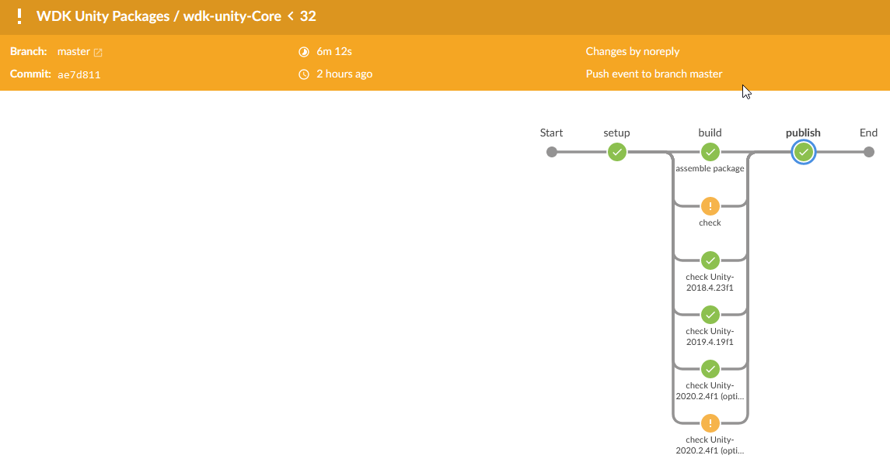
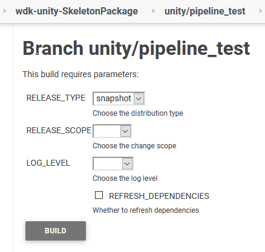
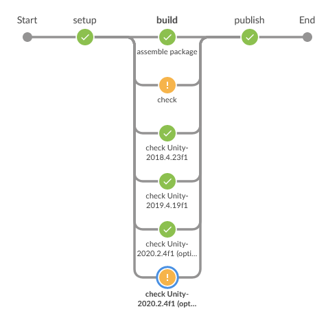
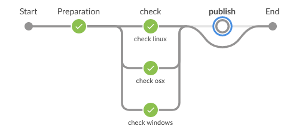

# Atlas Jenkins Pipeline Shared Library

This repository contains a series of steps and variables for use by Wooga's WDKs.

## Usage:

At the root of each WDK there's a Jenkins configuration file, [`Jenkinsfile`](https://www.jenkins.io/doc/book/pipeline/jenkinsfile/) which is used by our Jenkins CI in order to make a build pipeline for the repository:


```groovy 
#!groovy
// Imports the library from the github repository
@Library('github.com/wooga/atlas-jenkins-pipeline@1.x') _

...
```

These build pipelines can be triggered manually or can be configured to be triggered automatically  by specific actions (commits, pull requests, etc):



Some build pipelines provide parameters which can be set before starting the build from the interface:



## Steps:

### gradleWrapper

Invokes the gradle wrapper for the current platform (Windows/Unix);

#### Arguments:

* command: `string`
* returnStatus: `boolean` = *false*
* returnStdout: `boolean` = *false*

#### Usage:

```
gradleWrapper "testEditMode -P unity.testBuildTargets=android"
```

### buildWDKAutoSwitch

Constructs a pipeline that will build an [Unity](https://unity.com/) WDK for a set of given Unity versions, running any available tests. If the build is successful it will then generate a `paket` package and publish it to our `artifactory`, where it then can be used by other WDKs or game projects.



#### Parameters:

* RELEASE_TYPE: The type of release (snapshot by default)
* RELEASE_SCOPE: The version for the build (relevant for rc/final)
* LOG_LEVEL: If assigned, the log level that will be used by gradle
* REFRESH_DEPENDENCIES: If true, will refresh the upstream dependencies before starting the build (rather than using the cache)

#### Configuration:

* unityVersions: `BuildVersion[]`
* labels : `string[]`
* testLabels : `string[]`
* testEnvironment: `string[]`
* logLevel: `string` (`quiet, warn, info, debug`) = *info*
* refreshDependencies: `boolean` = *false*

**BuildVersion**

Each build version can be defined by just the string of the version or by a map with the following properties:

* version: string
* optional: boolean
* apiCompatibilityLevel: `net_standard_2_0, net_4_6`

#### Usage:

```groovy
// Build and test the wdk package with custom step
def args = 
[
    logLevel: info,
    unityVersions: 
    [
        '2019.4.19f1', 
        '2018.4.23f1', 
        [version : '2020.2.4f1', optional : true, apiCompatibilityLevel : 'net_standard_2_0'], 
        [version : '2020.2.4f1', optional : true, apiCompatibilityLevel : 'net_4_6']
    ]
]
buildWDKAutoSwitch args

```

### buildGradlePlugin

Builds a [Gradle plugin](https://docs.gradle.org/current/userguide/plugins.html), either releasing it to the [gradle plugin directory](https://plugins.gradle.org/search?term=net.wooga.unity) or building it locally.

### Configuration:

* platforms: string[]
* testEnvironment: string[]
* testLabels: string[]
* labels: string[]
* dockerArgs: [:] 



### Usage:

```groovy
def testEnvironment = [ 'osx':
       [
           "ATLAS_GITHUB_INTEGRATION_USER=${githubUser}",
           "ATLAS_GITHUB_INTEGRATION_PASSWORD=${githubPassword}"
       ],
     'windows':
       [
           "ATLAS_GITHUB_INTEGRATION_USER=${githubUser2}",
           "ATLAS_GITHUB_INTEGRATION_PASSWORD=${githubPassword2}"
       ],
     'linux':
       [
           "ATLAS_GITHUB_INTEGRATION_USER=${githubUser2}",
           "ATLAS_GITHUB_INTEGRATION_PASSWORD=${githubPassword2}"
       ]
]
buildGradlePlugin plaforms: ['osx','windows','linux'], testEnvironment: testEnvironment
```

# License
Copyright (C) Wooga GmbH 2018-2021 - All Rights Reserved
Unauthorized copying of this work, via any medium is strictly prohibited
Proprietary and confidential

[Avatar]:https://www.gravatar.com/avatar/81d74fed81ded734379cb1b58db32b1e?d=robohash&f=y&s=80
