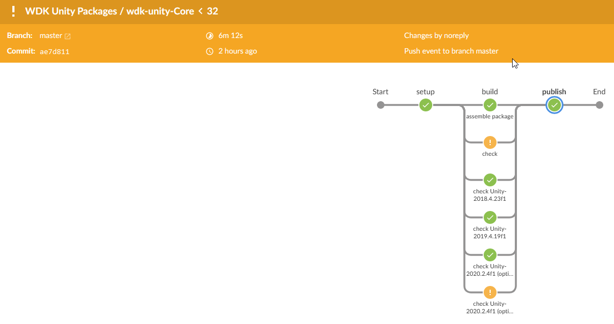
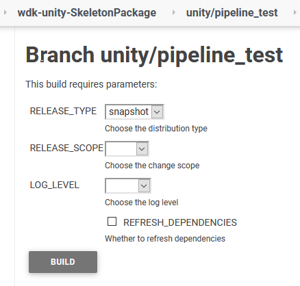
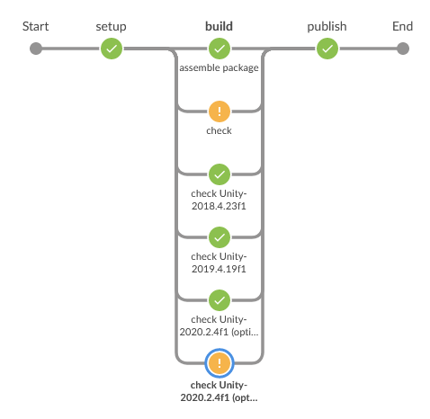
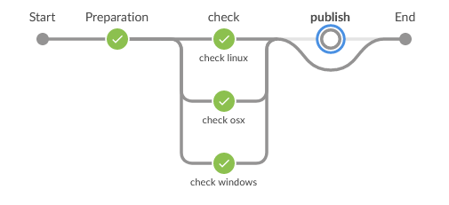

# Atlas Jenkins Pipeline Shared Library

This repository contains a series of steps and variables for use by Wooga's WDKs.

## Usage:

At the root of each WDK there's a Jenkins configuration file, [`Jenkinsfile`](https://www.jenkins.io/doc/book/pipeline/jenkinsfile/) which is used by our Jenkins CI in order to make a build pipeline for the repository:


```groovy 
#!groovy
// Imports the library from the github repository
@Library('github.com/wooga/atlas-jenkins-pipeline@1.x') _

...
```

These build pipelines can be triggered manually or can be configured to be triggered automatically  by specific actions (commits, pull requests, etc):



Some build pipelines provide parameters which can be set before starting the build from the interface:



## Steps:

### gradleWrapper

Invokes the gradle wrapper for the current platform (Windows/Unix);

#### Arguments:

* command: `string`
* returnStatus: `boolean` = *false*
* returnStdout: `boolean` = *false*

#### Usage:

```
gradleWrapper "testEditMode -P unity.testBuildTargets=android"
```

### dotnetWrapper

Provisions the requested .NET SDK into a shared per-agent cache directory (`~/.cache/dotnet` on unix, `%LOCALAPPDATA%\cache\dotnet` on Windows) via Microsoft's official install scripts, then invokes `dotnet` for the current platform (Windows/Unix) against it. Also idempotently registers the shared `wooga_nuget` NuGet feed (once per agent) and binds the `artifactory_read` Jenkins credential for the duration of the command, exporting `NuGetPackageSourceCredentials_wooga_nuget` so `dotnet restore`/`dotnet test` etc. can authenticate against it with no extra setup.

#### Arguments:

* command: `string`
* version: `string` (optional, exact SDK version)
* channel: `string` (optional, e.g. `8.0`, `LTS`)
* globalJson: `string` (optional, path to a `global.json` to read the version from)
* returnStatus: `boolean` = *false*
* returnStdout: `boolean` = *false*

At most one of `version` / `channel` / `globalJson` may be given. When none is given, a `global.json` in the workspace root is used if present (its `sdk.version`'s major.minor is tracked as a floating channel — same behavior as GitHub Actions' `setup-dotnet`; bump your `global.json` to move to a newer SDK), otherwise a pinned org-wide default version is installed.

#### Usage:

```
// selector auto-detected (workspace global.json, else org-wide default)
dotnetWrapper "build --configuration Release"

// explicit selector
dotnetWrapper(command: "test", channel: "8.0")
```

### withDotnet

Provisions the requested .NET SDK into the shared per-agent cache directory (same as `dotnetWrapper`) and runs the given block with it available on `PATH` (`DOTNET_ROOT` is also set), scoped to the block. Also idempotently registers the shared `wooga_nuget` NuGet feed (once per agent) and binds the `artifactory_read` Jenkins credential for the duration of the block, exporting `NuGetPackageSourceCredentials_wooga_nuget` so `dotnet restore`/`dotnet test` etc. can authenticate against it with no extra setup.

#### Arguments:

* version: `string` (optional, exact SDK version)
* channel: `string` (optional, e.g. `8.0`, `LTS`)
* globalJson: `string` (optional, path to a `global.json` to read the version from)

At most one of `version` / `channel` / `globalJson` may be given. When none is given, a `global.json` in the workspace root is used if present (its `sdk.version`'s major.minor is tracked as a floating channel — same behavior as GitHub Actions' `setup-dotnet`; bump your `global.json` to move to a newer SDK), otherwise a pinned org-wide default version is installed.

#### Usage:

```
withDotnet {
    sh "dotnet build"
}

withDotnet(version: "8.0.401") {
    sh "dotnet build"
}
```

**Caveat**: a `sh` script with its own login-shell shebang (`#!/bin/bash -l`) re-sources `/etc/profile` and `~/.bash_profile`/`~/.profile` before running, which on some agents unconditionally overwrites `PATH` — discarding the `PATH` `withDotnet` set before your script's first line runs. `DOTNET_ROOT` survives this. If you need a login shell, re-add it defensively: `export PATH="$DOTNET_ROOT:$PATH"` as the first line of your script.

### withDotnetTool

Provisions the requested .NET SDK (same as `withDotnet`) and installs the given NuGet package as a local (manifest-based) dotnet tool in the current workspace — creating a tool manifest (`dotnet tool install --create-manifest-if-needed`) if one doesn't already exist. The tool's package cache is redirected under the shared per-agent cache directory (`~/.cache/dotnet/tools` on unix, `%LOCALAPPDATA%\cache\dotnet\tools` on Windows) via `NUGET_PACKAGES`/`DOTNET_CLI_HOME`, instead of the default `~/.nuget/packages` / `~/.dotnet` locations.

Local tools aren't exposed as a bare command on `PATH` — invoke them from the block via `dotnet tool run <tool-binary>` (or the `dotnet <tool-binary>` shorthand `dotnet` itself prints after install).

#### Arguments:

* packageId: `string` (positional, or `packageId:` key in the map form)
* version: `string` (optional, exact tool version; passes `--allow-downgrade` too, so it also works when a different version is already installed)

#### Usage:

```
withDotnetTool("dotnet-ef") {
    sh "dotnet tool run dotnet-ef -- database update"
}

withDotnetTool(packageId: "dotnet-ef", version: "8.0.4") {
    sh "dotnet tool run dotnet-ef -- database update"
}
```

### runDotnetTool

Provisions the requested .NET SDK (same as `withDotnet`), installs the given NuGet package as a local dotnet tool (same as `withDotnetTool`), then runs it via `dotnet tool run <tool-binary>` with the given args.

#### Arguments:

* packageId: `string`
* toolBinary: `string`
* args: `list<string>` = *[]*
* version: `string` (optional, exact tool version, passes `--allow-downgrade`)
* returnStatus: `boolean` = *false*

#### Usage:

```
runDotnetTool("dotnet-ef", "dotnet-ef", ["database", "update"])

runDotnetTool(
    packageId: "dotnet-ef",
    toolBinary: "dotnet-ef",
    args: ["database", "update"],
    version: "8.0.4",
    returnStatus: true
)
```

### buildWDKAutoSwitch

Constructs a pipeline that will build an [Unity](https://unity.com/) WDK for a set of given Unity versions, running any available tests. If the build is successful it will then generate a `paket` package and publish it to our `artifactory`, where it then can be used by other WDKs or game projects.



#### Parameters:

* RELEASE_TYPE: The type of release (snapshot by default)
* RELEASE_SCOPE: The version for the build (relevant for rc/final)
* LOG_LEVEL: If assigned, the log level that will be used by gradle
* REFRESH_DEPENDENCIES: If true, will refresh the upstream dependencies before starting the build (rather than using the cache)

#### Configuration:

* unityVersions: `BuildVersion[]`
* labels : `string[]`
* testLabels : `string[]`
* testEnvironment: `string[]`
* logLevel: `string` (`quiet, warn, info, debug`) = *info*
* refreshDependencies: `boolean` = *false*

**BuildVersion**

Each build version can be defined by just the string of the version or by a map with the following properties:

* version: string
* optional: boolean
* apiCompatibilityLevel: `net_standard_2_0, net_4_6`

#### Usage:

```groovy
// Build and unit the wdk package with custom step
def args = 
[
    logLevel: info,
    unityVersions: 
    [
        '2019.4.19f1', 
        '2018.4.23f1', 
        [version : '2020.2.4f1', optional : true, apiCompatibilityLevel : 'net_standard_2_0'], 
        [version : '2020.2.4f1', optional : true, apiCompatibilityLevel : 'net_4_6']
    ]
]
buildWDKAutoSwitch args

```

### buildGradlePlugin

Builds a [Gradle plugin](https://docs.gradle.org/current/userguide/plugins.html), either releasing it to the [gradle plugin directory](https://plugins.gradle.org/search?term=net.wooga.unity) or building it locally.

### Configuration:

* platforms: string[]
* testEnvironment: string[]
* testLabels: string[]
* labels: string[]
* dockerArgs: [:] 



### Usage:

```groovy
def testEnvironment = [ 'osx':
       [
           "ATLAS_GITHUB_INTEGRATION_USER=${githubUser}",
           "ATLAS_GITHUB_INTEGRATION_PASSWORD=${githubPassword}"
       ],
     'windows':
       [
           "ATLAS_GITHUB_INTEGRATION_USER=${githubUser2}",
           "ATLAS_GITHUB_INTEGRATION_PASSWORD=${githubPassword2}"
       ],
     'linux':
       [
           "ATLAS_GITHUB_INTEGRATION_USER=${githubUser2}",
           "ATLAS_GITHUB_INTEGRATION_PASSWORD=${githubPassword2}"
       ]
]
buildGradlePlugin plaforms: ['osx','windows','linux'], testEnvironment: testEnvironment
```

# Development

Whenever work is done to update these pipelines, the changes are propagated like so:

1. The changes are added as a feature PR based on `master`. They must be merged into `master`.
2. A release must be made on the Jenkins CI for the job corresponding to this repository. As consequence, a new branch is made named after the newer version. 
3. Any jobs that use the pipeline must do a run before the newer changes are loaded. The simplest is to trigger a build with default parameters. Any builds after that should reflect the changes that the newer pipeline introduces.

# License
Copyright (C) Wooga GmbH 2018-2022 - All Rights Reserved
Unauthorized copying of this work, via any medium is strictly prohibited
Proprietary and confidential

[Avatar]:https://www.gravatar.com/avatar/81d74fed81ded734379cb1b58db32b1e?d=robohash&f=y&s=80
